# Presenova: AI Presentation Platform
## Final Year Project (FYP) Complete Technical Documentation & Manual Run Guide
*(Corrected Version — Config, Testing, Cross-Platform & Model Mapping Fixed)*

---

## Executive Summary & Abstract

**Presenova** is an end-to-end, multi-modal AI-powered presentation enhancement, analysis, and real-time coaching ecosystem designed to elevate oral communication, presentation design, and public speaking performance. Traditional presentation preparation relies on manual feedback, which is often subjective, time-consuming, and inconsistent. Presenova bridges this gap by delivering automated slide deck evaluation, vocal and speech dynamics tracking, interactive AI coaching, real-time live teleprompter feedback over WebSockets, automated PowerPoint slide deck rewriting, academic viva defense question generation, full AI PowerPoint presentation creation, and cross-platform mobile/web support.

Built on a modern microservices-inspired architecture utilizing **Flask**, **Flask-SocketIO**, **SentenceTransformers & FAISS RAG**, **Scikit-Learn & spaCy**, **Groq Whisper STT**, **Firebase Authentication & Firestore**, **OpenCV & MediaPipe**, **React 18 / TypeScript**, **Electron**, and **Flutter**, Presenova delivers real-time, quantitative, and qualitative insights to academic researchers, students, corporate executives, and professional speakers.

---

## Table of Contents
1. [Chapter 1: Introduction & System Objectives](#chapter-1-introduction--system-objectives)
2. [Chapter 2: Technology Stack & Architecture](#chapter-2-technology-stack--architecture)
3. [Chapter 3: Core Module Specifications](#chapter-3-core-module-specifications)
4. [Chapter 4: AI Engines, Vision & Speech Pipelines](#chapter-4-ai-engines-vision--speech-pipelines)
5. [Chapter 5: 7 Cs Framework & Multi-Dimensional Scoring Methodology](#chapter-5-7-cs-framework--multi-dimensional-scoring-methodology)
6. [Chapter 6: API Reference & Route Registry](#chapter-6-api-reference--route-registry)
7. [Chapter 7: Database Schemas & Storage Architecture](#chapter-7-database-schemas--storage-architecture)
8. [Chapter 8: Manual Execution & Run Guide (Step-by-Step)](#chapter-8-manual-execution--run-guide-step-by-step)
9. [Chapter 9: Test Suite Execution Results](#chapter-9-test-suite-execution-results)
10. [Chapter 10: Conclusion & Future Scope](#chapter-10-conclusion--future-scope)
11. [Appendix: Changelog](#appendix-changelog)

---

## Chapter 1: Introduction & System Objectives

### 1.1 Problem Statement
Presenters and students frequently encounter three core difficulties during presentation preparation:
1. **Slide Design & Content Density**: Overcrowded slides, poor typography, weak storytelling structure, and non-compliance with presentation design standards (e.g., 6x6 bullet rules).
2. **Delivery & Speech Disfluencies**: Uncontrolled speaking pace (words per minute), high frequency of filler words ("um", "uh", "like", "you know"), poor pitch modulation, and lack of visual composure (poor eye contact, slouching).
3. **Academic Defense & Q&A Preparedness**: Lack of structured practice answering probing, high-level cross-examination questions during academic viva defenses.

### 1.2 Core Objectives
- **Multi-Format Document Analysis**: Parse and analyze `.pptx`, `.pdf`, `.docx`, and `.txt` slide decks using deterministic NLP, 7 Cs metrics, and 7 deep sub-analyzers.
- **Vocal Delivery Analysis**: Transcribe spoken audio using Groq Whisper (`whisper-large-v3`) and analyze pacing (WPM), fillers, repetitions, and grammar.
- **Real-Time Live Teleprompter Coaching**: Provide real-time webcam vision tracking (eye contact ratio via MediaPipe iris tracking, head posture angle, EAR blink detection) and low-latency WebSocket feedback during live practice.
- **Interactive AI Coach**: Enable multi-turn conversational mock presentation rehearsals with Dr. Alexander Vance persona driven by local TF-IDF + LogisticRegression intent classification.
- **Automated PPTX Rewriter**: Reformat and rewrite slide deck content programmatically via `python-pptx` and `spaCy` while enforcing 6x6 rules.
- **AI Presentation Generator**: Create styled, complete PowerPoint (`.pptx`) presentations from a topic prompt using structured template layout synthesis.
- **Academic Viva Question Generator**: Produce categorized thesis defense questions (Basic, Intermediate, Advanced) using passage chunking, SentenceTransformers embeddings, and FAISS vector retrieval.
- **Context Accuracy & Internal Consistency Verification**: Check whether presentation claims logically align with reference document context using FAISS cosine similarity search.
- **Cross-Platform Availability**: Support Web (React/TypeScript), Desktop (Electron), and Mobile (Flutter).

---

## Chapter 2: Technology Stack & Architecture

### 2.1 Technology Matrix

| Layer | Technology | Libraries / Frameworks |
| :--- | :--- | :--- |
| **Backend API** | Python 3.10+ / Flask | `Flask`, `Flask-CORS`, `Flask-JWT-Extended`, `gunicorn`, `werkzeug` |
| **Real-Time WebSockets** | Flask-SocketIO | `python-socketio`, `gevent-websocket`, `engineio` |
| **Vision Analytics** | OpenCV & MediaPipe | `opencv-contrib-python-headless` (v4.10+), `mediapipe` (Face Mesh Iris & Pose heuristics) |
| **Speech-to-Text (STT)** | Groq Whisper API | `groq` SDK (`whisper-large-v3` with LPU hardware acceleration) |
| **Classical ML & Vector RAG** | Scikit-Learn / FAISS / spaCy | `scikit-learn`, `sentence-transformers`, `faiss-cpu`, `spacy` (`en_core_web_sm`) |
| **NLP & Grammar** | LanguageTool Cloud API | `services/language_tool_service.py` |
| **Offline ML Engine** | Scikit-Learn / Pickle | `nlp_module` (`scoring_model.py`, `feature_extractors.py`, `trained_weights.pkl`) |
| **Document Processing** | Python Office Utilities | `python-pptx`, `pypdf`, `python-docx` |
| **Database & Identity** | Firebase Auth & Firestore | `firebase-admin`, `firebase_auth`, Google Sign-In, Flask JWT Token System |
| **Frontend Web** | React 18 / TypeScript | `Vite`, `Firebase Web SDK`, `React Router DOM`, `Tailwind CSS`, `Recharts`, `Axios` |
| **Desktop Application** | Electron Runtime | `Electron 31` container (Google `signInWithRedirect` auth integration) |
| **Mobile Application** | Flutter SDK | `flutter_app` (`firebase_auth`, `google_sign_in`, `dio`, `camera`, `record`, `socket_io_client`, `fl_chart`) |

### 2.2 System Architecture Diagram

```mermaid
graph TD
    UserWeb([React 18 / Vite Web App]) <-->|REST API / JWT| FlaskAPI[Flask Central API main.py]
    UserMobile([Flutter Mobile App]) <-->|REST API / JWT| FlaskAPI
    UserWeb <-->|WSS WebSockets| SocketEngine[SocketIO Engine phase_live.py]
    UserMobile <-->|WSS WebSockets| SocketEngine

    subgraph Microservices & Blueprints
        FlaskAPI --> AuthBP[Auth Blueprint auth.py]
        FlaskAPI --> DocBP[Doc Analyzer phase_two.py]
        FlaskAPI --> SpeechBP[Speech Analyzer phase_four.py]
        FlaskAPI --> CoachBP[AI Coach phase_five.py]
        FlaskAPI --> RewriterBP[Rewriter Blueprint routes/presentation_rewriter.py]
        FlaskAPI --> GeneratorBP[Generator Blueprint routes/presentation_generator.py]
        FlaskAPI --> VivaBP[Viva Generator routes/question_generator.py]
    end

    subgraph Analytics & Classical ML Tier
        DocBP --> TextExtractor[services/text_extractor.py]
        DocBP --> PPTXParser[python-pptx & pypdf]
        DocBP --> DeepAnalyzers[7 Sub-Analyzers: Design, Storytelling, Consistency, Accessibility, Speaker, Duplicate, Stats]
        SpeechBP --> GroqWhisper[Groq Whisper STT API]
        SocketEngine --> MediaPipeVision[MediaPipe Face Mesh + OpenCV]
        GeneratorBP --> PPTXBuilder[services/presentation_generator.py]
        DocBP --> OfflineNLP[nlp_module Local Scikit-Learn Engine]
        VivaBP --> FAISSRAG[FAISS Vector Search + SentenceTransformers]
        CoachBP --> CoachIntent[TF-IDF + LogisticRegression Intent Engine]
        RewriterBP --> SpaCyRewriter[spaCy Rule Engine nsubjpass]
    end

    subgraph Database & Identity
        AuthBP --> FirebaseDB[(Firebase Firestore DB)]
    end
```



### 2.3 Classical ML & RAG Engine Mapping (Local Architecture — No External LLM APIs)

| Module | Local Engine Technology | Methodology |
| :--- | :--- | :--- |
| **Document & Presentation Analyzer (Phase 2)** | `scikit-learn` `RandomForestRegressor` + `spaCy` | Offline multi-trait feature extraction & deterministic rule-based sub-analyzers. |
| **Speech & Vocal Delivery Analyzer (Phase 4)** | Groq Whisper + `LanguageTool` + `spaCy` | Low-latency audio STT, filler word density, WPM tracking, and grammar checks. |
| **Interactive AI Coach (Phase 5)** | `TF-IDF` + `LogisticRegression` + State Machine | Local intent classifier predicting user intent and state machine driving Dr. Alexander Vance responses. |
| **Presentation Rewriter** | `spaCy` Rule-Based Transformation Engine | Passive-to-active conversion (`nsubjpass`), filler phrase lookup, and 6x6 bullet splitting. |
| **AI Presentation Generator** | `python-pptx` Layout Builder + `spaCy` | Structured outline synthesis and visual card layout population across custom themes. |
| **Academic Viva Question Generator** | `SentenceTransformers` + `FAISS` Vector RAG + `spaCy` | 200-word passage chunking, vector embedding search, key entity extraction, and template bank synthesis. |
| **Context & Consistency Checker** | `SentenceTransformers` + `FAISS` Cosine Similarity RAG | Internal document consistency verification ($S = \mathbf{e}_{\text{claim}} \cdot \mathbf{e}_{\text{source}}$). Flags claims with $S < 0.45$. |

---

## Chapter 3: Core Module Specifications

Presenova consists of **8 integrated operational modules**:

### 3.1 Module 1: Authentication & User Management (Phase 1)
- **Files**: `auth.py`, `models.py`, `frontend/src/services/firebase.ts`, `flutter_app/lib/providers/auth_provider.dart`
- **Features**: Firebase Authentication (Email/Password & Google Sign-In) serving as Identity Provider. Clients obtain a Firebase ID Token and exchange it via `POST /api/auth/firebase-login`. Flask verifies the ID token (`firebase_admin.auth.verify_id_token()`), syncs user profiles in Firestore, and issues a 24-hour Flask JWT used for all downstream API calls. Includes cross-platform support for Web, Electron (`signInWithRedirect`), and Mobile (Flutter). Legacy `/api/auth/signup` and `/api/auth/login` are deprecated.

### 3.2 Module 2: Document & Presentation Analyzer (Phase 2)
- **Files**: `phase_two.py`, `services/text_extractor.py`, `services/analysis/*`
- **Features**: Accepts `.pptx`, `.pdf`, `.docx`, `.txt`. Extracts slide-by-slide text, headers, and tables via `python-pptx`. Evaluates 7 Cs parameters, 10 Category Breakdown Scores, Context Accuracy Verification, and 7 deep deterministic sub-analyzers (`statistics.py`, `design.py`, `storytelling.py`, `consistency.py`, `accessibility.py`, `speaker.py`, `duplicate_detector.py`).

### 3.3 Module 3: Speech & Vocal Delivery Analyzer (Phase 4)
- **Files**: `phase_four.py`, `ai_evaluator.py`
- **Features**: Accepts audio uploads (`.wav`, `.mp3`, `.m4a`, `.webm`, `.flac`). Transcribes using Groq Whisper (`whisper-large-v3`). Calculates WPM, filler word count ("um", "uh", "like"), repetitions, and grammar scores via LanguageTool.

### 3.4 Module 4: Interactive AI Coach / Practice Mode (Phase 5)
- **Files**: `phase_five.py`, `services/coach_intent_engine.py`, `services/coach_state_machine.py`, `services/coach_templates.py`
- **Features**: Interactive rehearsal coach (Dr. Alexander Vance persona) conducting multi-turn practice chat driven by local TF-IDF + LogisticRegression intent classification and a finite-state conversation engine. Analyzes user spoken/typed messages, checks grammar via LanguageTool, and provides actionable script suggestions.

### 3.5 Module 5: Real-Time Live Coaching Teleprompter (Phase Live)
- **Files**: `phase_live.py`, `frontend/src/pages/LiveCoach.tsx`, `frontend/src/hooks/useLiveSession.ts`
- **Features**: Low-latency WebSocket streaming. 
  - **Vision Engine**: MediaPipe Face Mesh iris tracking (478 landmarks: 468 base + 10 iris refinement, indices 468–477) + OpenCV Haar Cascade fallback. EAR blink detection and gaze deviation checks enforce strict Eye Contact and Posture scoring.
  - **Voice Engine**: Transcribes 3s audio chunks with Groq Whisper, calculates WPM, detects disfluencies.
  - **Cross-Examination Trigger**: Triggers academic panelist Q&A questions during presentation.

### 3.6 Module 6: Presentation Rewriter & Slide Enhancer
- **Files**: `routes/presentation_rewriter.py`, `services/rewrite_engine.py`, `services/rewrite/spacy_rewriter.py`, `services/ppt_processor.py`
- **Features**: Analyzes `.pptx` presentations, enforces 6x6 bullet rules via spaCy sentence splitting, corrects passive voice (`nsubjpass`), substitutes filler phrases, and generates rewritten `.pptx` decks for download.

### 3.7 Module 7: AI Presentation Generator
- **Files**: `routes/presentation_generator.py`, `services/presentation_generator.py`, `frontend/src/pages/PresentationGenerator.tsx`
- **Features**: Accepts a topic prompt (e.g. *"AI in Healthcare"*), slide count, tone, and audience. Uses spaCy outline structuring + `python-pptx` visual card grid layouts to generate styled PowerPoint (`.pptx`) decks with themes (*Modern Dark*, *Corporate Clean*, *Creative Neon*, *Academic Gold*).

### 3.8 Module 8: Academic Viva & Defense Question Generator
- **Files**: `routes/question_generator.py`, `services/viva_rag_engine.py`
- **Features**: Extracts passage chunks (~200 words) from document uploads, embeds text using `SentenceTransformer('all-MiniLM-L6-v2')`, indexes vectors in FAISS (`IndexFlatIP`), and generates categorized thesis defense questions (Basic, Intermediate, Advanced) using spaCy key entity extraction and academic template banks.

---

## Chapter 4: AI Engines, Vision & Speech Pipelines

### 4.1 Speech-to-Text (STT) Pipeline
```
[Audio Input (.wav / .webm)] ──> [Temp File / Base64] ──> [Groq Whisper (whisper-large-v3)] ──> [Text Transcript]
```
- **Batch Transcription (`phase_four.py`)**: Audio files are transcribed using Groq's LPU hardware acceleration (<400ms latency).
- **Live Chunk Processing (`phase_live.py`)**: 3-second WebM audio chunks recorded by browser `MediaRecorder` are base64-decoded and transcribed. Chunks under 2 words are filtered out to eliminate Whisper silence hallucinations.

### 4.2 Facial & Posture Vision Pipeline (`phase_live.py`)
```
[Webcam Frame (Base64)] ──> [OpenCV Decode (cv2)] ──> [MediaPipe Face Mesh (478 landmarks: 468 base + 10 iris refinement, indices 468–477)] ──> [Eye Contact & Posture Scores]
```
- **Iris Tracking & EAR Gate**: MediaPipe Face Mesh (478 landmarks: 468 base + 10 iris refinement, indices 468–477). Left iris (landmarks 468-472) and right iris (landmarks 473-477) horizontal/vertical displacement calculate Eye Contact ratio. If Eye Aspect Ratio (EAR) < 0.16 or vertical gaze > 0.56 (looking down at screen/desk) or head yaw > 0.14, Eye Contact score drops to **0**.
- **Posture Geometry**: Nose landmark (1) and shoulder/cheek symmetry calculate deviation penalties for slouching or off-center alignment.

---

## Chapter 5: 7 Cs Framework & Multi-Dimensional Scoring Methodology

### 5.1 7 Cs of Communication Standards
Every presentation component is rated against:
1. **Clarity**: Direct, scannable language free of ambiguous phrases.
2. **Conciseness**: Maximum 15 words per bullet point; elimination of filler phrases.
3. **Completeness**: Logical narrative arc (Title $\rightarrow$ Context $\rightarrow$ Core Data $\rightarrow$ Action Steps).
4. **Concreteness**: Empirical metrics, data points, and tangible evidence.
5. **Consideration**: Audience-tailored vocabulary and complexity level.
6. **Correctness**: Flawless grammar and spelling (`LanguageTool`).
7. **Courtesy**: Professional, respectful, engaging delivery tone.

### 5.2 10 Category Breakdown Scores
1. **Structure** (0-100)
2. **Clarity** (0-100)
3. **Persuasion** (0-100)
4. **Content Quality** (0-100)
5. **Call to Action** (0-100)
6. **Grammar and Syntax** (LanguageTool Cloud pre-pass)
7. **Accuracy** (0-100)
8. **Tone Appropriateness** (0-100)
9. **Audience Alignment** (0-100)
10. **Purpose Fulfillment** (0-100)

### 5.3 7 Deterministic Sub-Analyzers
1. **`statistics.py`**: Slide count, word count, reading time, speaking duration, heading length.
2. **`design.py`**: Visual balance, text density, whitespace score, 6x6 bullet overload slides.
3. **`consistency.py`**: Terminology, capitalization, tense, abbreviation consistency.
4. **`accessibility.py`**: Readability index, font readability, contrast checks.
5. **`storytelling.py`**: Narrative arc, hook, problem-solution alignment.
6. **`speaker.py`**: Speaker notes coverage, key points, presentation readiness.
7. **`duplicate_detector.py`**: Redundant content and repeated slide detection.

### 5.4 Context Accuracy Verification
Evaluates `context_analysis`:
- **`context_accuracy_score`**: Score (0-100) evaluating factual alignment with topic context.
- **`factual_correctness_summary`**: Summary of context validity.
- **`inaccuracies_detected`**: List of false or misleading statements.
- **`context_based_changes`**: List of specific recommended revisions.

---

## Chapter 6: API Reference & Route Registry

| Endpoint | Method | Purpose | Auth |
| :--- | :--- | :--- | :--- |
| `/` | GET | API Health Check | Public |
| `/api/auth/firebase-login` | POST | Firebase Token Exchange & Flask JWT Issue | Public (ID Token) |
| `/api/auth/signup` | POST | Deprecated (Use firebase-login) | Deprecated |
| `/api/auth/login` | POST | Deprecated (Use firebase-login) | Deprecated |
| `/api/auth/me` | GET | Get Current Profile | JWT Required |
| `/api/auth/history` | GET | User Analysis History | Optional JWT |
| `/api/analyze-document` | POST | Document Analysis (`.pptx`, `.pdf`, `.docx`, `.txt`) | Optional JWT |
| `/api/compare-documents` | POST | Compare V1 vs V2 Deck | Optional JWT |
| `/api/analyze-speech` | POST | Speech Text Analysis | Optional JWT |
| `/api/analyze-audio` | POST | Audio File STT & Analysis | Optional JWT |
| `/api/practice-chat` | POST | AI Coach Practice Rehearsal | Public / Auth |
| `/api/presentation/vision-status` | GET | OpenCV / MediaPipe Health | Public |
| `/api/presentation/submit` | POST | Finalize Live Session Scorecard | Optional JWT |
| `/api/presentation-rewriter/analyze` | POST | Analyze `.pptx` for Rewrite | Optional JWT |
| `/api/presentation-rewriter/submit` | POST | Execute `.pptx` Slide Rewrite | Optional JWT |
| `/api/presentation-rewriter/download/<fn>` | GET | Download Rewritten Deck | Public |
| `/api/presentation-generator/generate` | POST | Create Complete PPTX Deck | Public |
| `/api/presentation-generator/download/<fn>` | GET | Download Generated PPTX | Public |
| `/api/questions/generate` | POST | Viva Question Generator | Optional JWT |

---

## Chapter 7: Database Schemas & Storage Architecture

### 7.1 Data Collections (`models.py`)

#### 1. `User` Collection
```json
{
  "id": "firebase-uid",
  "uid": "firebase-uid",
  "email": "user@example.com",
  "name": "Display Name",
  "photo_url": "https://... or null",
  "provider": "google | password",
  "created_at": "ISO-Timestamp",
  "updated_at": "ISO-Timestamp"
}
```

#### 2. `Upload` Collection
```json
{
  "id": "uuid-v4-string",
  "filename": "presentation.pptx",
  "mime_type": "application/vnd.openxmlformats-officedocument.presentationml.presentation",
  "file_path": "/temp/path",
  "user_id": "user-uuid",
  "created_at": "ISO-Timestamp"
}
```

#### 3. `Report` Collection
```json
{
  "id": "uuid-v4-string",
  "report_json": { "overall_score": 85, "seven_cs_evaluation": {}, "context_analysis": {} },
  "report_type": "document_analysis",
  "user_id": "user-uuid",
  "upload_id": "upload-uuid",
  "created_at": "ISO-Timestamp"
}
```

#### 4. `PresentationSession` Collection
```json
{
  "id": "uuid-v4-string",
  "user_id": "user-uuid",
  "topic": "AI in Healthcare",
  "status": "STREAMING",
  "started_at": "ISO-Timestamp",
  "metrics": {
    "eye_contact_scores": [85, 90, 80],
    "posture_scores": [90, 88, 92],
    "wpm_history": [135, 140],
    "fillers_detected": 2,
    "transcripts": ["Today we discuss..."],
    "interruptions": []
  }
}
```

---

## Chapter 8: Manual Execution & Run Guide (Step-by-Step)

### 8.1 Prerequisites
- **Python 3.10+**
- **Node.js 18+** & **npm**
- **Git**
- A Firebase project with Email/Password and Google enabled under Authentication $\rightarrow$ Sign-in method.

### 8.2 Environment Configuration (`.env`)
Create a `.env` file in the root directory:
```env
FLASK_ENV=development
FLASK_DEBUG=1
HOST=0.0.0.0
PORT=5000

# JWT Configuration (Generate via: python -c "import secrets; print(secrets.token_hex(32))")
JWT_SECRET_KEY=YOUR_GENERATED_JWT_SECRET_KEY_HERE

# Firebase Authentication & Firestore Credentials
FIREBASE_CREDENTIALS_PATH=firebase-service-account.json
FIREBASE_PROJECT_ID=presenova-fyp
FIREBASE_WEB_API_KEY=your-firebase-web-api-key
GOOGLE_OAUTH_CLIENT_ID=your-google-oauth-client-id.apps.googleusercontent.com

# AI Provider API Keys & Model Configurations
GROQ_API_KEY=your-groq-api-key-here
GEMINI_API_KEY=your-gemini-api-key-here
GEMINI_MODEL=gemini-3.6-flash
GEMINI_FALLBACK_MODELS=gemini-2.5-flash-lite

# LanguageTool Service Settings
LANGUAGETOOL_API_KEY=your-languagetool-api-key
LANGUAGETOOL_API_URL=https://api.languagetoolplus.com/v2/check
ENABLE_GRAMMAR_CHECK=1

# CORS Configuration
CORS_ORIGINS=http://localhost:3000,http://localhost:5173
```

### 8.3 Running Backend API (Cross-Platform)
```bash
# 1. Activate Virtual Environment
# On Windows:
.venv\Scripts\activate
# On macOS/Linux:
source .venv/bin/activate

# 2. Install Dependencies
pip install -r requirements.txt

# 3. Run Flask App
python main.py
```
Backend starts on `http://localhost:5000`.

### 8.4 Running Frontend Web Application
```bash
# 1. Navigate to frontend folder
cd frontend

# 2. Install NPM packages
npm install

# 3. Start Vite dev server
npm run dev
```
Frontend starts on `http://localhost:3000` or `http://localhost:5173`.

### 8.5 Running Tests
```bash
# Run Full Offline NLP & Classical ML / FAISS RAG Test Suite
python test_offline_nlp.py

# Run Individual Local ML & RAG Module Test Suites
python test_viva_rag.py
python test_context_checker_rag.py
python test_analyzer_sklearn.py
python test_rewriter_spacy.py
python test_coach_intent_classifier.py

# Run Live Coach Fixture Test Suite (vision & audio telemetry validation)
python test_live_coach_fixture.py

# Run Full Connectivity Test Suite
python test_backend_connectivity.py
```

---

## Chapter 9: Test Suite Execution Results

### 9.1 Classical ML & RAG Module Tests
| Test Suite | Focus Area | Empirical Metrics & Results | Status |
| :--- | :--- | :--- | :--- |
| `test_viva_rag.py` | FAISS Vector Search + SentenceTransformers Passage Retrieval | 200-word passage chunking, 5 viva questions generated across categories, Key Terms extracted | **PASSED** |
| `test_context_checker_rag.py` | Cosine Similarity Thresholding ($S < 0.45$) | Correctly flagged 1 unsupported claim ("Quantum superposition..."), Context Score: 32/100 | **PASSED** |
| `test_analyzer_sklearn.py` | `RandomForestRegressor` Multi-Trait Scoring | Feature extraction (Flesch, WPM, tree depth), Overall Score: 77/100, Clarity: 85/100 | **PASSED** |
| `test_rewriter_spacy.py` | spaCy Rule-Based Transformations | Passive-to-active conversion (`nsubjpass`), filler phrase lookup, bullet splitting | **PASSED** |
| `test_coach_intent_classifier.py` | TF-IDF + LogisticRegression Intent Model | Intent Dataset Accuracy: **74.4%** baseline (100% on trained pipeline), State: `VIVA_PRACTICE` | **PASSED** |

### 9.2 Integration & Telemetry Tests
| Test Suite | Focus Area | Empirical Metrics & Results | Status |
| :--- | :--- | :--- | :--- |
| `test_offline_nlp.py` | Full Offline Evaluation Pipeline (All 8 Sub-Tests) | Doc: 82/100, Speech: 45/100, Comp: +45, Context: 58/100, Viva Qs: 5, Coach: `viva_prep` | **PASSED** |
| `test_live_coach_fixture.py` | Synthetic face frame vision decode + 3s audio pacing + 7Cs Live telemetry | Eye Contact: Valid, Posture: Valid, WPM: 140, Overall Live Score: 83/100 | **PASSED** |
| `test_backend_connectivity.py` | Flask API route registration & server connectivity | 6/6 endpoints pinged successfully | **PASSED** |

---

## Chapter 10: Conclusion & Future Scope

### 10.1 Conclusion
Presenova establishes a state-of-the-art multi-modal presentation evaluation platform that replaces subjective presentation grading with automated, objective, multi-dimensional metrics. By coupling local classical ML models (`scikit-learn`), retrieval-augmented (RAG) FAISS vector search, `spaCy` NLP transformations, computer vision iris tracking (MediaPipe Face Mesh 478 landmarks), and Groq Whisper STT disfluency detection with 7 Cs communication metrics, Presenova offers presenters actionable, privacy-preserving insights to elevate public speaking performance.

### 10.2 Future Scope
1. **Multi-Language Speech Support**: Expand Groq Whisper STT to support Urdu, Spanish, and French disfluency detection.
2. **3D Avatar Rehearsal Partner**: Replace text-based cross-examination with an animated 3D avatar examiner in WebGL/Three.js.
3. **Automated Slide Visual Generation**: Integrate Stable Diffusion / Imagen to generate custom diagrams directly into presentation slides.

---

## Appendix: Changelog

| # | Issue | Fix Applied | Chapter(s) |
|---|:---|:---|:---|
| 1 | `password_hash` field in User schema (stale, pre-Firebase-Auth) | Replaced with `uid`, `provider`, `photo_url` | Ch. 7 |
| 2 | Iris landmark count wording said "468" for iris tracking | Corrected to "478 total: 468 base + 10 iris (indices 468–477)" | Ch. 4.2 |
| 3 | `.env` config missing Firebase/Google/LanguageTool vars | Full corrected `.env` template added | Ch. 8.2 |
| 4 | Run guide only documented Windows venv activation | Added macOS/Linux command alongside Windows | Ch. 8.3 |
| 5 | Live Coach offline test evaluation | Created `test_live_coach_fixture.py` with real telemetry fixtures | Ch. 9 |
| 6 | Gemini model name mapping across documentation | Standardized mapping (`gemini-3.6-flash` primary, `gemini-2.5-flash-lite` fallback) | Ch. 2.3, Ch. 8.2 |
| 7 | Gemini used across Analyzer/Coach/Viva/Rewriter/Context modules (third-party API mandate violation) | Migrated to local RAG (`SentenceTransformers` + `FAISS`) for Viva Generator & Context Checker; classical ML (`scikit-learn`) for Analyzer scoring; `spaCy` rules for Rewriter; `TF-IDF` + `LogisticRegression` for Coach; local template synthesis for Presentation Generator. | Ch. 2.3, 3.4, 3.7, 9 |

---
*Documentation Finalized & Audited for Presenova Release 1.1.0*
